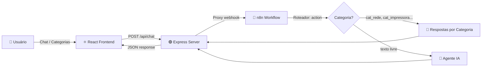

<div align="center">

# 🤖 HelpDesk IA — Suporte de TI Inteligente

**Assistente virtual de suporte técnico (N1/N2) com triagem automática, base de conhecimento e gestão de chamados — integrado ao n8n.**

[](https://react.dev)
[](https://www.typescriptlang.org)
[](https://vitejs.dev)
[](https://tailwindcss.com)
[](https://n8n.io)
[](LICENSE)

</div>

---

## 📋 Sobre

O **HelpDesk IA** é uma aplicação web que simula um chat de suporte de TI empresarial com interface moderna estilo WhatsApp. O sistema faz a **triagem inteligente** de problemas técnicos através de categorias predefinidas, oferece uma **base de conhecimento integrada** com soluções passo a passo e permite a **abertura de chamados (tickets)** quando o problema requer atendimento N2.

Todo o processamento de IA é delegado a um workflow **n8n** via webhook, permitindo total flexibilidade na configuração de respostas, integrações e automações.

---

## ✨ Features

| Feature | Descrição |
|---|---|
| 💬 **Chat Inteligente** | Interface de chat com suporte a markdown, blocos de código e anexo de imagens |
| 📂 **Triagem por Categoria** | 10 categorias de TI predefinidas com roteamento automático no n8n |
| 🎫 **Gestão de Chamados** | Criação, acompanhamento e atualização de status de tickets (Aberto → Em Atendimento → Resolvido) |
| 📚 **Base de Conhecimento** | Artigos com soluções passo a passo, busca e filtro por categoria |
| ⚙️ **Configurações** | Webhook URL configurável, perfil do usuário, teste de conexão, export de histórico |
| 📱 **Visão Mobile** | Toggle entre layout desktop e simulação de dispositivo móvel |
| 💾 **Persistência Local** | Mensagens, tickets e configurações salvos no localStorage |
| 🎨 **Animações** | Transições suaves com Framer Motion em toda a interface |

---

## 🏗️ Arquitetura



### Fluxo de Dados

1. Usuário digita uma mensagem ou clica em uma categoria
2. Frontend envia `POST /api/chat` com `action`, `message`, `callback_data` e `sessionId`
3. Express encaminha para o **webhook do n8n**
4. O **Roteador Principal** do n8n verifica o campo `action`:
   - `action` começa com `cat_` → rota para tratamento por **categoria**
   - `action` = `chat` → rota para **texto livre** (agente IA)
5. Resposta JSON retorna com `reply`, `options` e `suggestedTicket`

---

## 🛠️ Stack Tecnológica

| Camada | Tecnologia |
|---|---|
| **Frontend** | React 19 · TypeScript · Tailwind CSS v4 |
| **Backend** | Express 4 · tsx (dev server) |
| **Bundler** | Vite 6 |
| **Animações** | Motion (Framer Motion) |
| **Ícones** | Lucide React |
| **Automação/IA** | n8n (webhook) |

---

## 🚀 Instalação

### Pré-requisitos

- [Node.js](https://nodejs.org/) (v18+)
- Um workflow n8n com webhook configurado ([n8n.io](https://n8n.io))

### Setup

```bash
# 1. Clone o repositório
git clone https://github.com/seu-usuario/helpdesk-ia.git
cd helpdesk-ia

# 2. Instale as dependências
npm install

# 3. Configure as variáveis de ambiente
cp .env.example .env
```

Edite o `.env`:

```env
GEMINI_API_KEY=sua_chave_aqui
APP_URL=http://localhost:3000
N8N_WEBHOOK_URL=https://seu-n8n.app.n8n.cloud/webhook/helpdesk
```

```bash
# 4. Inicie o servidor de desenvolvimento
npm run dev
```

Acesse **http://localhost:3000** 🎉

---

## ⚙️ Configuração do n8n

O workflow do n8n deve ter um **Webhook trigger** que recebe POST com o seguinte payload:

```json
{
  "action": "cat_rede",
  "message": "🌐 Rede e Internet",
  "callback_data": "cat_rede",
  "sessionId": "user-abc123",
  "history": []
}
```

### Roteamento esperado

| Campo `action` | Rota |
|---|---|
| `start` | Mensagem de boas-vindas |
| `cat_rede` | Rede e Internet |
| `cat_impressora` | Impressoras |
| `cat_login` | Login e Acesso |
| `cat_hardware` | Hardware |
| `cat_email` | E-mail / Outlook |
| `cat_seguranca` | Segurança |
| `cat_arquivos` | Pastas e Arquivos |
| `cat_erp` | Sistemas e ERP |
| `cat_audio` | Áudio e Vídeo |
| `cat_celular` | Celular Corporativo |
| `chat` *(fallback)* | Texto livre → Agente IA |

### Formato de resposta esperado

```json
{
  "reply": "Resposta formatada em **Markdown**...",
  "options": [
    { "text": "1 - Sim, resolveu", "callback_data": "resolved_yes" },
    { "text": "2 - Preciso de mais ajuda", "callback_data": "resolved_no" },
    { "text": "3 - 🎫 Criar Chamado", "callback_data": "create_ticket" }
  ],
  "suggestedTicket": {
    "needed": false,
    "category": "Rede e Internet",
    "priority": "Média",
    "title": "Resumo do problema"
  }
}
```

---

## 📁 Estrutura do Projeto

```
helpdesk-ia/
├── server.ts                    # Express backend (proxy n8n)
├── index.html                   # Entry point HTML
├── vite.config.ts               # Vite + Tailwind + React
├── package.json                 # Dependências e scripts
├── .env                         # Variáveis de ambiente
├── src/
│   ├── main.tsx                 # React entry
│   ├── App.tsx                  # Componente principal
│   ├── types.ts                 # Tipos TypeScript
│   ├── index.css                # Tailwind import
│   ├── data/
│   │   └── categories.ts       # Categorias de TI predefinidas
│   └── components/
│       ├── Header.tsx           # Header com status e ações
│       ├── QuickCategories.tsx  # Barra de categorias rápidas
│       ├── ChatMessage.tsx      # Mensagens com markdown
│       ├── TypingIndicator.tsx  # Indicador "digitando..."
│       ├── SettingsModal.tsx    # Configurações do app
│       ├── TicketModal.tsx      # Criação de chamados
│       ├── TicketsDrawer.tsx    # Lista de chamados
│       └── KnowledgeBaseModal.tsx # Base de conhecimento
```

---

## 📜 Scripts

| Comando | Descrição |
|---|---|
| `npm run dev` | Inicia servidor de desenvolvimento |
| `npm run build` | Build de produção (Vite + esbuild) |
| `npm start` | Roda build de produção |
| `npm run lint` | Verifica tipos TypeScript |

---

## 🗺️ Roadmap

- [ ] Modo IA local (Gemini) sem depender do n8n
- [ ] Temas personalizáveis (dark, light, WhatsApp)
- [ ] Notificações sonoras
- [ ] Persistência em banco de dados
- [ ] Dashboard de métricas de atendimento
- [ ] Autenticação de usuários
- [ ] Upload de múltiplos arquivos

---

## 📄 Licença

Este projeto está sob a licença [MIT](LICENSE).

---

<div align="center">

Feito com ❤️ para equipes de suporte de TI

</div>
